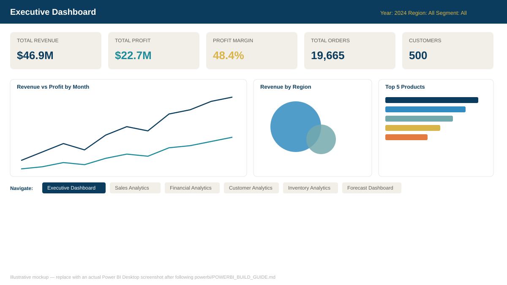

# Enterprise Sales & Finance Analytics Dashboard

An end-to-end Business Intelligence portfolio project: a synthetic-but-realistic
retail dataset flows through a Python ETL pipeline into a SQL Server star
schema and a six-page Power BI executive dashboard, with an auto-generated
plain-English insights report layered on top.



## Overview

| Layer | Tech | What it does |
|---|---|---|
| Data generation | Python (pandas, numpy) | Produces a realistic, intentionally messy sample dataset |
| ETL | Python | Cleans, deduplicates, type-fixes, and engineers a star schema |
| Data warehouse | SQL Server (T-SQL) | Star schema DDL, indexes, views, KPI queries with joins/CTEs/window functions |
| BI layer | Power BI Desktop | 6-page interactive dashboard: DAX measures, Power Query, bookmarks, drill-through, tooltips |
| Insights | Python | Auto-generated executive insights report from the KPI tables |

See `docs/ARCHITECTURE.md` for the full data-flow diagram.

## Folder structure

```
Enterprise-Sales-Finance-Analytics-Dashboard/
├── data/
│   ├── raw/            # generated raw CSVs (messy, pre-cleaning)
│   └── processed/       # cleaned star-schema CSVs
├── sql/                 # DDL, bulk load, analytical queries, views
├── python/               # ETL, KPI, and insights scripts
├── powerbi/              # DAX, Power Query M, theme, build guide
├── docs/                 # architecture, dataset, installation docs
├── screenshots/           # dashboard preview image(s)
├── reports/               # generated KPI tables + executive insights
├── README.md
├── requirements.txt
├── .gitignore
└── LICENSE
```

## Dataset

~19,600 cleaned order-line transactions (2022–2024) across 500 customers,
22 products in 5 categories, and 10 countries in 4 regions, generated with a
fixed random seed for reproducibility. Full details in `docs/DATASET.md`.

## Features / dashboard pages

1. **Executive Dashboard** — revenue, profit, margin, orders, customers at a glance
2. **Sales Analytics** — trend lines, average order value, category mix
3. **Financial Analytics** — profit & margin trend, margin-health status
4. **Customer Analytics** — growth trend, tiering, top customers, repeat rate
5. **Inventory Analytics** — stock vs. reorder level, turnover, restock risk
6. **Forecast Dashboard** — built-in Power BI forecasting + linear trend & moving average measures

Every page uses synced slicers (year, region, category, segment), a shared
navigation bar, bookmarks for common filter presets, drill-through to a
product-level detail page, and report-page tooltips.

## KPIs implemented
Revenue, Profit, Profit Margin %, Sales Growth (MoM/YoY), Average Order
Value, Customer Growth %, Repeat Customer Rate, Inventory Turnover Ratio,
Top Products, Top Customers, Regional Performance — all as reusable DAX
measures (`powerbi/DAX/measures.dax`) and mirrored in SQL
(`sql/03_analysis_queries.sql`) and Python (`python/build_kpis.py`).

## Installation

Full walkthrough in `docs/INSTALLATION.md`. Quick start:

```powershell
python -m venv .venv
.venv\Scripts\activate
pip install -r requirements.txt

cd python
python generate_sample_data.py
python clean_data.py
python prepare_sql_csv.py
python build_kpis.py
python generate_insights.py
cd ..
```

Then follow `powerbi/POWERBI_BUILD_GUIDE.md` to assemble the `.pbix` in
Power BI Desktop (relationships, DAX, and page layout are fully specified —
it's wiring, not designing). Optionally load the SQL Server warehouse with
`sql/01_schema.sql` and `sql/02_load_data.sql`.

## Screenshots

`screenshots/executive_dashboard_preview.svg` is an illustrative mockup of
the intended layout. After building the report in Power BI Desktop, export
real screenshots (File > Export > PDF, or Snipping Tool) into this folder to
replace it before publishing your portfolio.

## Business insights (sample, from the generated dataset)

Full report at `reports/executive_insights.md` after running the pipeline.
Typical findings include:
- Best- and worst-performing regions by revenue and margin
- Most profitable and lowest-margin products
- Customer acquisition trend and most recent month-over-month growth
- Products currently at or below reorder level, with warehouse and quantity
- A short list of executive recommendations derived directly from the KPIs

## Future improvements
- Swap the synthetic dataset for a real transactional export
- Add Row-Level Security (RLS) roles in Power BI for regional managers
- Automate the ETL with a scheduled task or Azure Data Factory pipeline
- Publish to Power BI Service and configure a scheduled refresh
- Add a Streamlit or Power BI paginated-report version for print-friendly exports

## Resume description

> Designed and built an end-to-end Business Intelligence solution
> (Python, SQL Server, Power BI) featuring a star-schema data warehouse,
> an ETL pipeline that cleaned and validated ~20K transactional records,
> and a 6-page interactive executive dashboard with DAX-driven KPIs,
> drill-through analysis, and automated insight generation — reducing
> manual reporting effort and surfacing regional and product-level
> profitability trends for leadership decision-making.

## License
MIT — see `LICENSE`.
