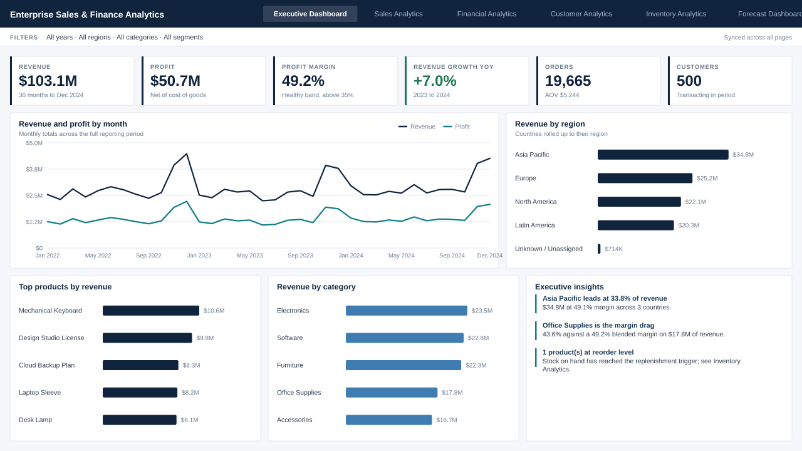
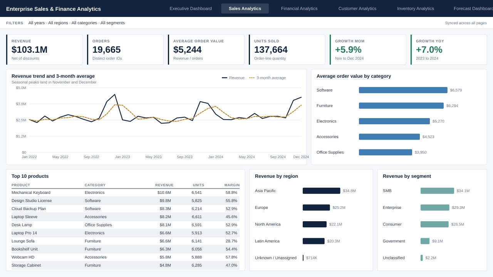
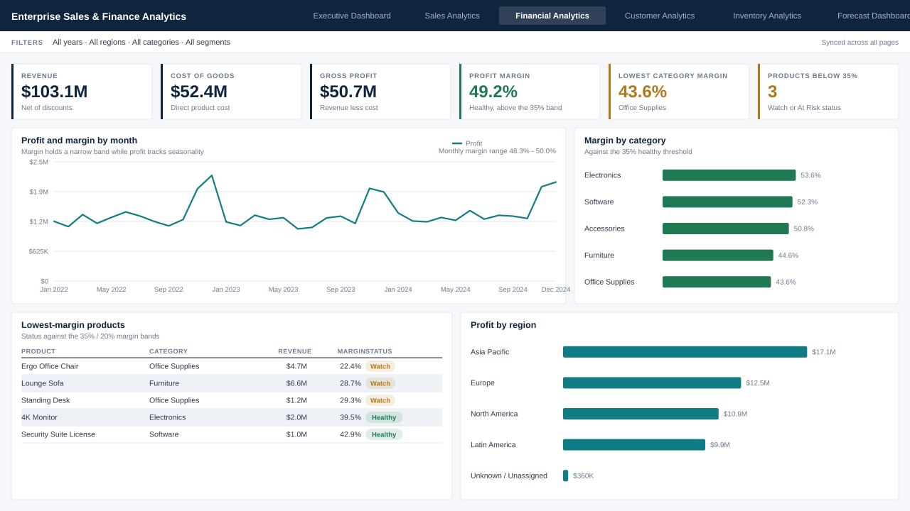
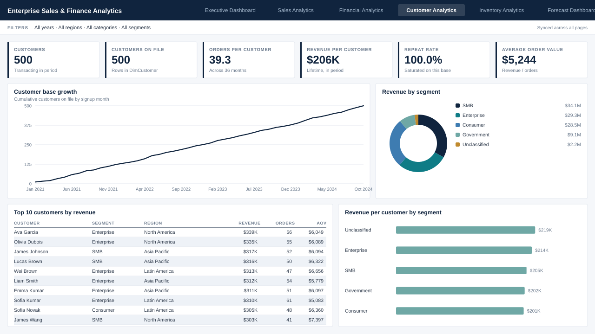
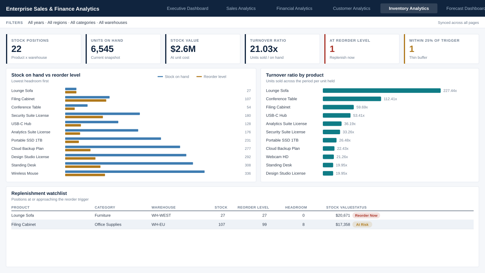
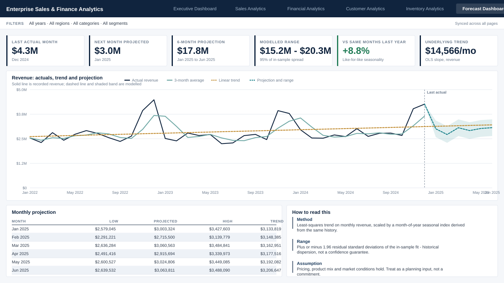

# Enterprise Sales & Finance Analytics Dashboard

An end-to-end Business Intelligence project. A synthetic-but-realistic retail
dataset flows through a Python ETL pipeline into a SQL Server star schema and a
six-page Power BI executive dashboard, with an automatically generated
executive insights report layered on top.



## Overview

| Layer | Tech | What it does |
|---|---|---|
| Data generation | Python (pandas, numpy) | Produces a realistic, intentionally messy sample dataset |
| ETL | Python | Cleans, deduplicates, type-fixes, and engineers a star schema |
| Data warehouse | SQL Server (T-SQL) | Star schema DDL, indexes, views, KPI queries with joins, CTEs and window functions |
| KPI layer | Python | Twelve KPI tables that back the report and cross-check the DAX |
| BI layer | Power BI Desktop | Six-page dashboard: DAX measures, Power Query, theme, bookmarks, drill-through, tooltips |
| Insights | Python | Executive insights report in Markdown and print-ready HTML |
| Previews | Python | Data-driven SVG renders of all six report pages |

`docs/ARCHITECTURE.md` has the full data-flow diagram.
`docs/KPI_DEFINITIONS.md` is the contract that keeps the Python, SQL and DAX
implementations of each KPI in agreement.

## Dashboard pages

Every page answers one question and is laid out on the same grid.

| Page | Question it answers |
|---|---|
| Executive Dashboard | How is the business performing? |
| Sales Analytics | Where are sales coming from and what drives them? |
| Financial Analytics | Are we growing profitably? |
| Customer Analytics | Who are our customers and how do they behave? |
| Inventory Analytics | Where are we exposed to inventory risk? |
| Forecast Dashboard | What is likely to happen next? |

All six share a navigation bar, a synced slicer strip (year, region, category,
segment), bookmark presets, drill-through to a product detail page, and report
page tooltips.

<details>
<summary><b>Sales Analytics</b> — trend and 3-month average, AOV by category, top products, region and segment mix</summary>


</details>

<details>
<summary><b>Financial Analytics</b> — profit trend, margin by category against the 35% healthy band, lowest-margin products with status</summary>


</details>

<details>
<summary><b>Customer Analytics</b> — base growth, revenue by segment, top customers, revenue per customer</summary>


</details>

<details>
<summary><b>Inventory Analytics</b> — stock against reorder level, turnover by product, replenishment watchlist</summary>


</details>

<details>
<summary><b>Forecast Dashboard</b> — actuals, trend, moving average and a six-month projection with its range</summary>


</details>

The previews are rendered from the KPI tables by
`python/build_dashboard_previews.py`, on the same 1280×720 canvas Power BI uses,
so the numbers on them are the pipeline's actual output and the panel
coordinates double as the layout specification in
`powerbi/POWERBI_BUILD_GUIDE.md`.

## Folder structure

```
enterprise-sales-finance-analytics-dashboard/
├── data/
│   ├── raw/             # generated raw CSVs (messy, pre-cleaning)
│   └── processed/       # cleaned star-schema CSVs
├── sql/                 # DDL, bulk load, analytical queries, views
├── python/              # ETL, KPI, insights, and preview scripts
├── powerbi/             # DAX, Power Query M, theme, build guide
├── docs/                # architecture, dataset, KPI definitions, installation
├── screenshots/         # generated preview of each report page
├── reports/             # generated KPI tables + executive insights (MD + HTML)
├── README.md
├── requirements.txt
└── LICENSE
```

## Dataset

19,665 cleaned order-line transactions (January 2022 – December 2024) across
500 customers, 22 products in 5 categories, and 10 countries in 4 regions,
generated with a fixed random seed for reproducibility. Full details in
`docs/DATASET.md`.

Headline figures from the shipped run: **$103.1M revenue, $50.7M profit, 49.2%
margin, $5,244 average order value, +7.0% revenue growth 2023 → 2024.**

## KPIs

Revenue · Profit · Profit Margin % · Sales Growth MoM/YoY · Average Order Value
· Customer Growth % · Repeat Customer Rate · Inventory Turnover Ratio · Top
Products · Top Customers · Regional Performance.

Each is implemented three times — as a DAX measure
(`powerbi/DAX/measures.dax`), as T-SQL (`sql/03_analysis_queries.sql`,
`sql/04_views.sql`), and in Python (`python/build_kpis.py`) — from a single
written definition in `docs/KPI_DEFINITIONS.md`, including the margin health
bands, the reorder risk bands, and the rule that all margins are
revenue-weighted.

## Installation

Full walkthrough in `docs/INSTALLATION.md`. Quick start:

```powershell
python -m venv .venv
.venv\Scripts\activate
pip install -r requirements.txt

python python\generate_sample_data.py
python python\clean_data.py
python python\prepare_sql_csv.py
python python\build_kpis.py
python python\generate_insights.py
python python\build_dashboard_previews.py
```

That populates `data/raw/`, `data/processed/`, `reports/` and `screenshots/`.
Then follow `powerbi/POWERBI_BUILD_GUIDE.md` to assemble the `.pbix` — every
query, relationship, measure, colour and visual position is specified.
Optionally load the SQL Server warehouse with `sql/01_schema.sql` and
`sql/02_load_data.sql`.

## Executive insights

`python/generate_insights.py` reads the KPI tables and writes
`reports/executive_insights.md` and `reports/executive_insights.html` (styled
and print-ready) from one set of findings, so the two cannot disagree. Every
figure is read from a KPI table; nothing is hand-written.

The report covers regional and category performance, profitability and margin
outliers, customer behaviour, inventory risk, a six-month outlook with its
method stated, prioritised recommendations, and a data-quality section.

Two design decisions in that generator are worth calling out, because they are
the difference between a report and a plausible-looking report:

- **Data-quality buckets are excluded from rankings.** Revenue whose source
  region failed referential integrity sits in an `Unknown / Unassigned` bucket
  and customers with a blank segment in an `Unclassified` bucket. Both are
  reported in the totals and named in the data-quality section, but neither can
  be returned as "the worst-performing region" or "the segment to invest in".
- **Findings adapt to what the data shows.** Where a metric is saturated or a
  spread is immaterial, the report says so and points at the measure that does
  carry signal, instead of asserting a conclusion the numbers do not support.

## Notes on the data

Because the dataset is synthetic and orders are assigned to customers
uniformly at random, two metrics behave unlike a real transactional extract and
the reporting layer states this rather than working around it:

- **Repeat Customer Rate reads 100%.** Every customer has ordered many times
  (39.3 orders each on average), so the metric is saturated. Orders per customer
  is the informative depth measure on this dataset.
- **Revenue concentration is very low.** The top 10 customers hold 3.1% of
  revenue, so there is no Pareto tail to analyse.

Both are properties of the generator, not analytical errors, and both are
documented in `docs/KPI_DEFINITIONS.md`. Swapping in a real extract restores
normal behaviour without changing any downstream logic.

## Future improvements

- Swap the synthetic dataset for a real transactional export
- Give the generator realistic customer purchase concentration so the retention
  and concentration metrics carry signal
- Add Row-Level Security roles in Power BI for regional managers
- Automate the ETL with a scheduled task or Azure Data Factory pipeline
- Publish to the Power BI Service with a scheduled refresh
- Add a paginated-report version for print-friendly exports

## Resume description

> Designed and built an end-to-end Business Intelligence solution
> (Python, SQL Server, Power BI) featuring a star-schema data warehouse,
> an ETL pipeline that cleaned and validated ~20K transactional records,
> and a six-page interactive executive dashboard with DAX-driven KPIs,
> drill-through analysis, and automated insight generation — reducing
> manual reporting effort and surfacing regional and product-level
> profitability trends for leadership decision-making.

## License

MIT — see `LICENSE`.
