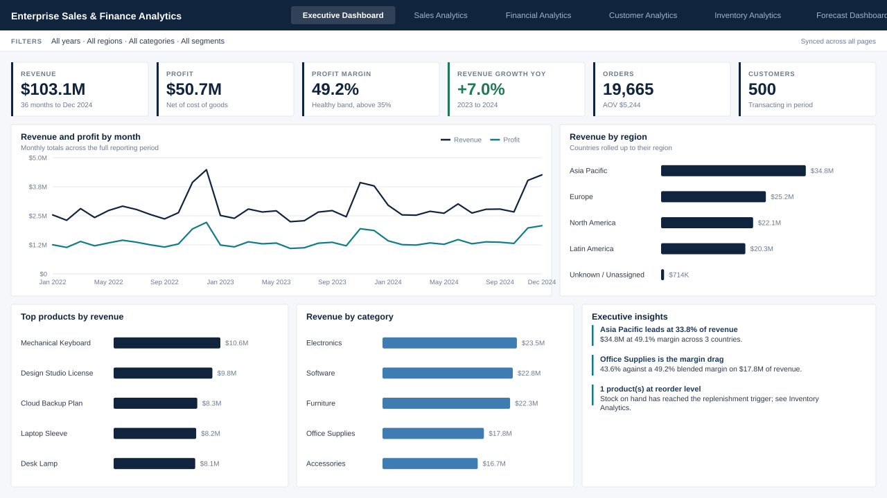

# Auto Retail Market & Dealership Performance Analytics

A business-intelligence project built from the seat of a **multi-brand automobile dealer group** holding Toyota,
Honda Cars, JSW MG Motor, Mercedes-Benz and Ather franchises. It answers three questions a dealer's leadership
team asks every month:

1. **Are our franchise brands winning or losing ground in the market?** Answered with *real* national retail data.
2. **Where is each showroom losing customers or money?** A sales-funnel and inventory-ageing KPI framework.
3. **How is the business performing on revenue, margin, customers and stock?** A six-page executive dashboard.

Stack: Python (pandas, matplotlib) · SQL Server (T-SQL, window functions) · Power BI (DAX, Power Query).

## Headline findings (real data)

Source: [FADA](https://fada.in) monthly vehicle retail registrations, February–September 2026 against the same
months of 2025, all-India. Full memo: [`reports/auto_retail/AUTO_RETAIL_BRIEF.md`](reports/auto_retail/AUTO_RETAIL_BRIEF.md).

- **The car market grew 22.1%, but the four portfolio car brands together grew only 7.4%.** Their combined share
  fell from 11.02% to 9.70% (−133 bps), about 43,800 cars short of where they would have been at constant share.
- **Toyota lost the most share among portfolio brands (−87 bps)** even while growing 7.9% in units. Share moved to
  Tata Motors (+153 bps) and Maruti Suzuki (+128 bps).
- **Ather grew 82.0% against a 21.5% two-wheeler market**, raising its share from 1.07% to 1.60%.
- **EV share of car retail rose from 3.48% to 8.45%** between February and September 2026.


**Recommendations** (detailed in the brief): treat Ather as the growth engine for capital and outlet expansion;
defend car share through showroom conversion rather than volume pushes; keep ageing stock of below-market brands
under weekly review; and stock fast-moving variants for the festive quarter, given September's rebound.

## What is in the project

| Layer | Question | Data | Main files |
|---|---|---|---|
| **Auto retail market** | Which brands gain or lose share; growth vs segment; EV shift | **Real** (FADA) | `python/auto_retail_analysis.py`, `sql/05_auto_retail_market.sql`, `powerbi/DAX/auto_retail_measures.dax` |
| **Dealership KPI framework** | Funnel conversion by showroom; stock ageing and holding cost | **Simulated**, demand pattern follows real FADA trends | `python/dealership_kpi_simulation.py`, [`DEALERSHIP_KPI_FRAMEWORK.md`](reports/auto_retail/DEALERSHIP_KPI_FRAMEWORK.md) |
| **Executive sales & finance BI** | Revenue, profit, margin, customers, inventory, forecast | **Synthetic** retail dataset | `python/` ETL scripts, `sql/01–04`, `powerbi/` |

### Data honesty

- **Real:** everything in `data/external/` and `reports/auto_retail/` except files prefixed `sim_`. Sources, extraction
  method and validation checks are in [`data/external/SOURCES.md`](data/external/SOURCES.md). Every month's OEM rows
  are checked to sum exactly to FADA's published total.
- **Simulated:** files prefixed `sim_`. Real showroom data is private, so these illustrate how the KPIs work. Every
  assumption is listed in the framework document.
- **Synthetic:** `data/raw/` and `data/processed/`, generated with a fixed random seed to demonstrate the ETL,
  star schema and dashboard build.

## Dealership KPI framework (simulated data)

Defines eight operating KPIs (enquiry → test drive → booking → delivery conversion, days in stock, aged-stock %,
holding cost, first-service retention), each with a formula, owner, review cadence and action trigger. The
simulation shows the mechanism behind aged stock: slow-selling variants making up a larger share of orders than of
customer demand.


## Executive sales & finance dashboard (synthetic data)

A Python ETL pipeline cleans ~19,600 messy order lines (500 customers, 22 products, 10 countries in 4 regions,
2022–2024) into a SQL Server star schema feeding a six-page Power BI report: Executive, Sales, Financial,
Customer, Inventory and Forecast. Eleven KPIs (revenue, profit, margin, YoY growth, AOV, repeat rate, inventory
turnover and more) are defined once in [`docs/KPI_DEFINITIONS.md`](docs/KPI_DEFINITIONS.md) and implemented
identically in DAX, T-SQL and Python. An executive review with recommendations is generated automatically:
[`reports/executive_insights.md`](reports/executive_insights.md).

The page images below are rendered from the KPI tables by `python/build_dashboard_previews.py`, on the same grid
the Power BI build guide uses, so every number shown is computed rather than mocked up.



Other pages: [Sales](screenshots/sales_analytics.svg) · [Financial](screenshots/financial_analytics.svg) ·
[Customer](screenshots/customer_analytics.svg) · [Inventory](screenshots/inventory_analytics.svg) ·
[Forecast](screenshots/forecast_dashboard.svg)

## Run it

```bash
python -m venv .venv
.venv\Scripts\activate          # macOS/Linux: source .venv/bin/activate
pip install -r requirements.txt

cd python
python auto_retail_analysis.py        # real-data market analysis, charts and brief
python dealership_kpi_simulation.py   # simulated showroom KPIs
python generate_sample_data.py        # synthetic BI dataset ...
python clean_data.py
python prepare_sql_csv.py
python build_kpis.py
python generate_insights.py
python build_dashboard_previews.py
```

SQL Server: run `sql/01_schema.sql` → `02_load_data.sql` → `03`/`04`, and `05_auto_retail_market.sql` for the
market layer (update the data path at the top of each load script). Power BI: follow
[`powerbi/POWERBI_BUILD_GUIDE.md`](powerbi/POWERBI_BUILD_GUIDE.md), which specifies every query, relationship,
measure and visual position, including the Auto Retail Market and Dealership KPI pages. Full setup:
[`docs/INSTALLATION.md`](docs/INSTALLATION.md).

## Repository layout

```
data/external/      real FADA data + SOURCES.md
data/raw/, processed/  synthetic BI dataset (messy raw, cleaned star schema)
python/             analysis, simulation, ETL, KPI and report scripts
sql/                star schema, loads, KPI queries, views, auto-retail market layer
powerbi/            DAX measures, Power Query M, theme, build guide
reports/            KPI tables, executive review, auto_retail/ brief and KPI framework
screenshots/        charts and dashboard page previews
docs/               architecture, dataset, KPI definitions, installation
```

## Limitations

- FADA publishes all-India figures only, with no OEM-by-state split, so the market layer cannot show performance in
  a specific state. A dealer would overlay its own showroom data.
- Eight months of data (Feb–Sep 2026), compared year on year with the same months to avoid seasonal distortion.
- The dealership and executive-dashboard layers use simulated and synthetic data and make no claim about any real
  company's performance.

## License

MIT. See `LICENSE`. FADA data remains the property of its publisher and is used here for analysis with attribution.
