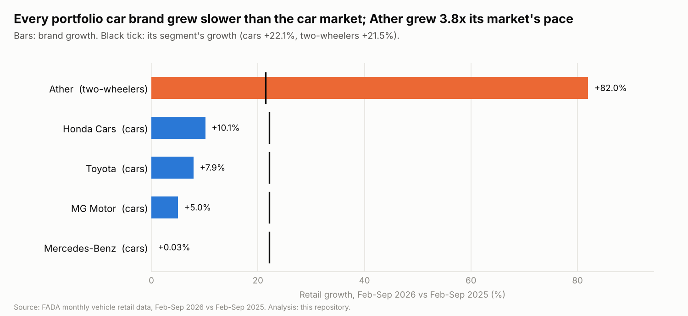
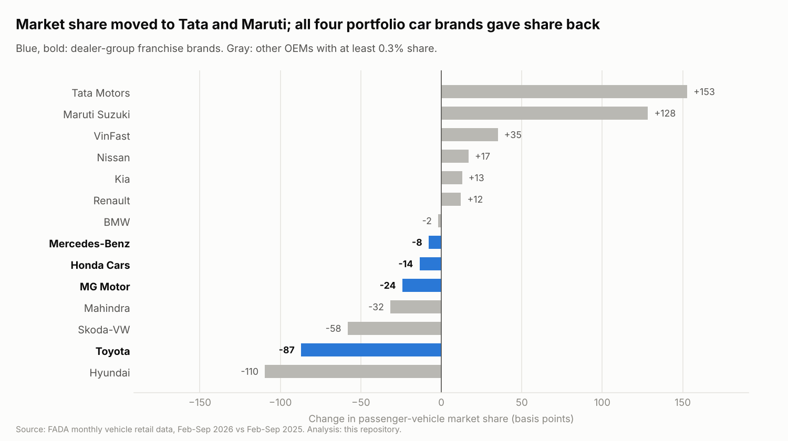
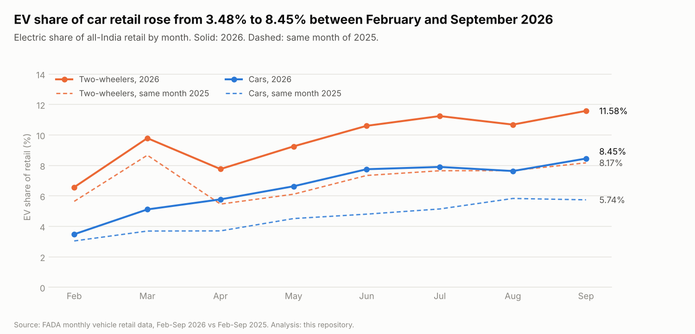

# Auto Retail Market Brief: Portfolio Brand Performance

**Perspective:** a multi-brand dealer group holding Toyota, Honda Cars, JSW MG Motor and Mercedes-Benz car franchises and an Ather two-wheeler franchise.  
**Data:** FADA monthly vehicle retail (registration) data, February–September 2026 against the same months of 2025, all-India. Every figure below is computed by `python/auto_retail_analysis.py`.

## Bottom line

The car market grew **+22.1%**, but the four portfolio car brands together grew only **+7.4%**. Their combined share fell from 11.02% to 9.70% (-133 bps). Had they simply held share, they would have retailed about **43,837 more cars** nationally over eight months. Ather is the opposite case: **+82.0%** growth against a +21.5% two-wheeler market.

## Brand scorecard

| Brand | Segment | Units Feb–Sep 2026 | YoY growth | Segment growth | Market share | Share change (bps) |
|---|---|---:|---:|---:|---|---:|
| Toyota | Passenger vehicles | 218,392 | +7.9% | +22.1% | 7.49% → 6.61% | -87 |
| MG Motor | Passenger vehicles | 49,028 | +5.0% | +22.1% | 1.73% → 1.48% | -24 |
| Honda Cars | Passenger vehicles | 41,043 | +10.1% | +22.1% | 1.38% → 1.24% | -14 |
| Mercedes-Benz | Passenger vehicles | 11,732 | +0.03% | +22.1% | 0.43% → 0.36% | -8 |
| Ather | Two-wheelers | 232,471 | +82.0% | +21.5% | 1.07% → 1.60% | +53 |

## Findings

1. **Share is moving to mass-market leaders.** Tata Motors gained +153 bps and Maruti Suzuki +128 bps. Toyota, the largest portfolio brand, lost the most among portfolio brands (-87 bps) despite growing +7.9% in units.
2. **Luxury is flat for the portfolio brand, not for the segment.** Mercedes-Benz units were +0.03% (flat: 11,732 vs 11,729) while BMW grew +16.2%.
3. **September shows a turn.** In September alone, Toyota grew +21.6%, Honda Cars +42.5% and Mercedes-Benz +26.6% year on year. One month is not a trend; it is a reason to have stock and sales capacity ready for the festive quarter.
4. **Electrification is accelerating.** EV share of car retail rose from 3.48% (Feb) to 8.45% (Sep), and of two-wheelers from 6.57% to 11.58%. Ather is an EV-only brand, so its franchise rides this shift directly.

## Recommendations for the dealer group

1. **Treat Ather as the growth engine.** Prioritise working capital, outlet expansion and service capacity for the brand growing several times faster than its market.
2. **Defend car share locally with conversion, not volume pushes.** National share loss means each walk-in matters more: track enquiry → test drive → booking → delivery conversion weekly by showroom (see the dealership KPI framework in `reports/auto_retail/DEALERSHIP_KPI_FRAMEWORK.md`).
3. **Tighten inventory for slower brands.** Where a brand grows below market, keep days-in-stock and ageing (60+ day) stock under weekly review to limit holding cost.
4. **Prepare for the festive quarter.** September's rebound across Toyota, Honda Cars and Mercedes-Benz supports stocking fast-moving variants ahead of October–November.

## Limits of this analysis

- National data only. FADA does not publish OEM-by-state splits, so this does not show performance in any specific state; a dealer would overlay its own showroom data.
- Registrations (retail), not wholesale dispatches. They measure customer deliveries, the number a dealer is judged on.
- Eight months. Compare the same months year on year, as done here, to avoid seasonal distortion.
- Altigreen (electric three-wheeler cargo) does not appear individually in FADA's tables, so it is not analysed.

## Charts

