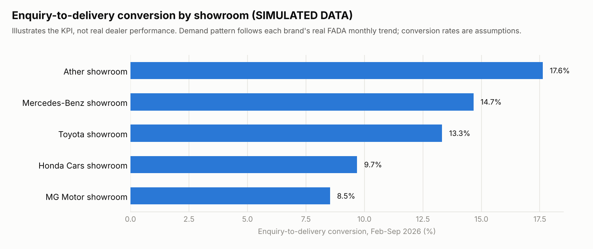

# Dealership KPI Framework

How a dealer group turns the market brief into weekly showroom management. The **framework** (what to measure,
who owns it, how often it is reviewed, what triggers action) is the deliverable. The results table uses
**simulated data** because real showroom data is private; it shows the KPIs working, not real performance.

## KPIs

| KPI | Formula | Owner | Review | Action trigger |
|---|---|---|---|---|
| Enquiry → test drive % | test drives ÷ enquiries | Sales manager | Weekly | Below brand target for 2 weeks: review lead follow-up time and test-drive fleet availability |
| Test drive → booking % | bookings ÷ test drives | Sales manager | Weekly | Falls 5 pts below trailing average: review pricing, finance and exchange offers |
| Booking → delivery % | deliveries ÷ bookings | Showroom GM | Weekly | Below 85%: audit cancellations by reason (finance rejection, stock wait, competitor) |
| Enquiry → delivery % | deliveries ÷ enquiries | Showroom GM | Monthly | Compare across showrooms of the same brand; investigate the bottom performer |
| Days in stock | snapshot date − arrival date, per vehicle | Inventory manager | Weekly | Any unit over 60 days: prioritise in sales targets or reallocate between outlets |
| Aged stock % | units over 60 days ÷ units in stock | Business head | Monthly | Above 20%: reduce next order for that model |
| Inventory holding cost | Σ days in stock × vehicle value × daily funding rate | Finance | Monthly | Track against margin per vehicle; ageing erodes margin daily |
| First-service retention % | customers returning for 1st service ÷ deliveries due | Service manager | Monthly | Below 80%: call-back campaign; service is the long-term profit pool |

## Simulated results, February–September 2026

| Showroom | Enquiries | Enq → TD | TD → booking | Booking → delivery | Enq → delivery | Stock on 30 Sep | Stock over 60 days |
|---|---:|---:|---:|---:|---:|---:|---:|
| Ather showroom | 14,542 | 50.1% | 37.5% | 93.8% | 17.6% | 129 | 0% |
| Mercedes-Benz showroom | 941 | 55.4% | 29.0% | 91.4% | 14.7% | 16 | 0% |
| Toyota showroom | 7,469 | 45.4% | 32.5% | 90.2% | 13.3% | 100 | 43% |
| Honda Cars showroom | 3,695 | 41.5% | 26.5% | 88.2% | 9.7% | 47 | 38% |
| MG Motor showroom | 5,217 | 40.4% | 24.4% | 86.6% | 8.5% | 62 | 50% |

Reading the simulation: the showroom with the highest share of stock over 60 days is the **MG Motor showroom**
(50%). Stock over 60 days has already accumulated ₹46.9 lakh of holding
cost across showrooms. The cause in this model is variant mix: slow-selling variants are a bigger share of what is
ordered than of what customers buy. The action is to cut slow variants from the next order and push aged units
with targeted offers, not to cut the brand's total order. First-service retention is defined above but not simulated.

## Assumptions (illustrative, not measured)

| Showroom | Feb enquiries | Enq → TD | TD → booking | Booking → delivery | Avg vehicle value | Stock ordered vs deliveries | Slow variants in orders | Slow variants in demand |
|---|---:|---:|---:|---:|---:|---:|---:|---:|
| Toyota showroom | 900 | 45% | 32% | 90% | ₹1,400,000 | 1.10x | 18% | 12% |
| Honda Cars showroom | 420 | 42% | 28% | 88% | ₹1,100,000 | 1.10x | 22% | 12% |
| MG Motor showroom | 480 | 40% | 25% | 87% | ₹1,600,000 | 1.10x | 25% | 12% |
| Mercedes-Benz showroom | 110 | 55% | 30% | 92% | ₹7,500,000 | 1.10x | 20% | 15% |
| Ather showroom | 1,300 | 50% | 38% | 93% | ₹150,000 | 1.05x | 12% | 12% |

- Monthly enquiry volume follows each brand's **real** FADA retail trend, indexed to February.
- Holding cost uses 0.04% of vehicle value per day (about 14.6% a year).
- Aged stock comes from variant-mix mismatch: slow variants' share of orders exceeds their share of demand.
  Within each variant group, the oldest unit is delivered first. Random seed 42, so every run gives the same numbers.
- Generated by `python/dealership_kpi_simulation.py`.
